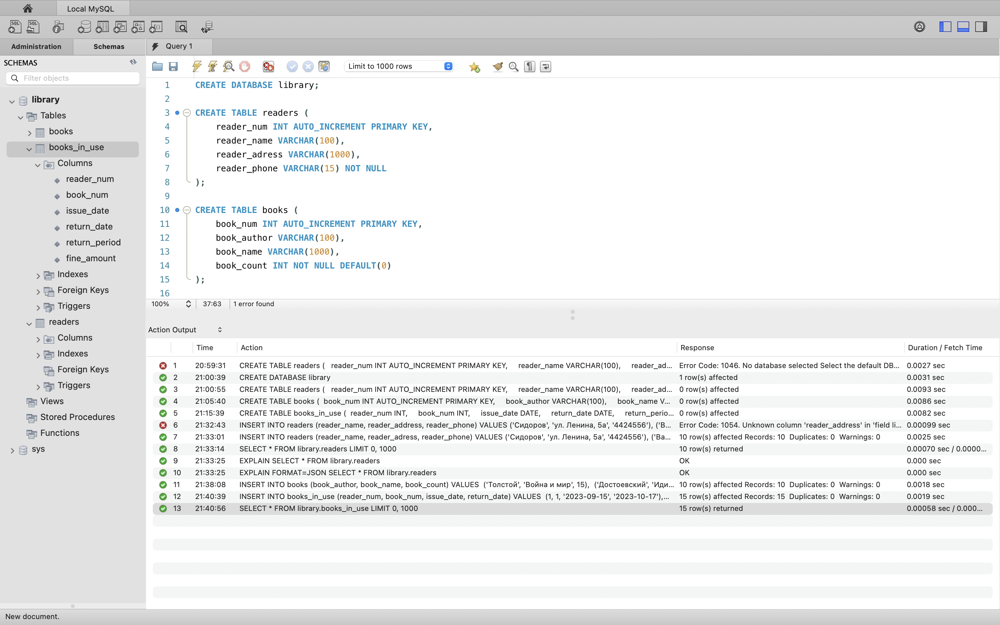
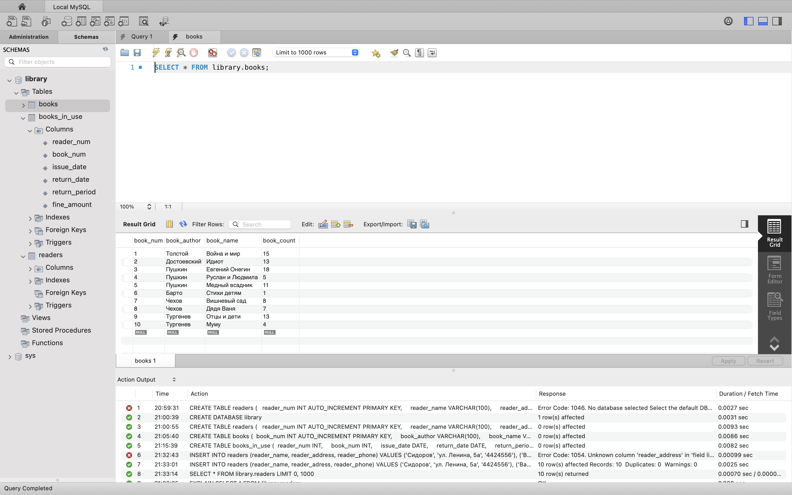
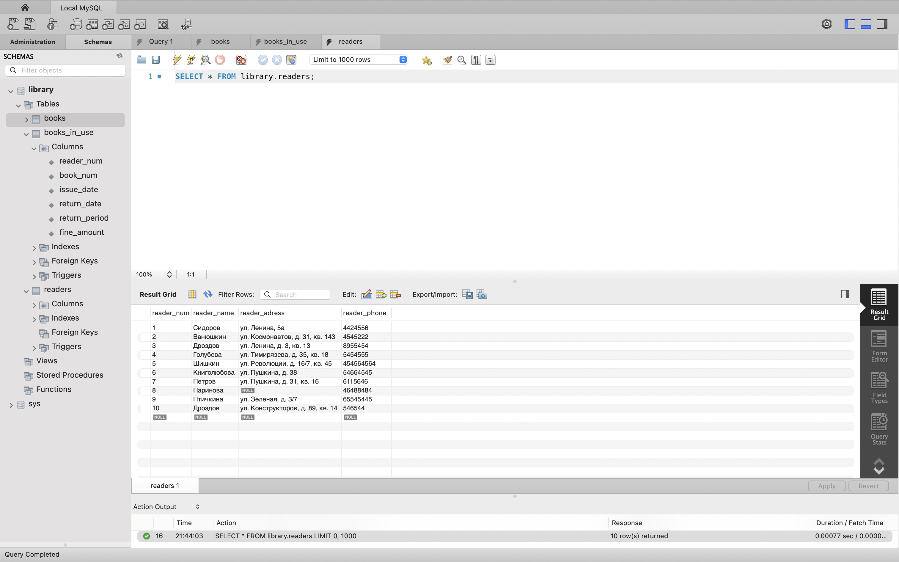
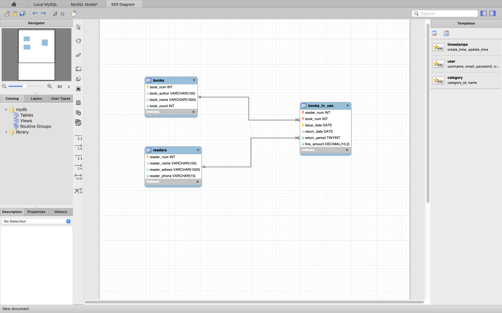

# 🧠 Python, OOP & MySQL Practice Repository

This is a collection of my practice tasks in **Python**, **OOP**, and **MySQL**.  
I'm using this repo to improve my coding and database skills by working on exercises and small projects.

---

## 📁 Contents

- `python/` – Various algorithmic and practical Python exercises  
- `oop/` – Object-Oriented Programming tasks and implementations  
- `sql/` – MySQL queries
- `MySQLWorkbench/` - screenshots from MySQLWorkbench

---

## 🧩 Example Screenshots

You can see ER diagrams and table screenshots from MySQL Workbench below:

---

## 🔐 Note on Personal Data

> **Disclaimer:** All personal data (such as names, addresses, or phone numbers etc) used in database examples are taken from public course materials or educational datasets.  
> No real or confidential user data is present in this repository.

---